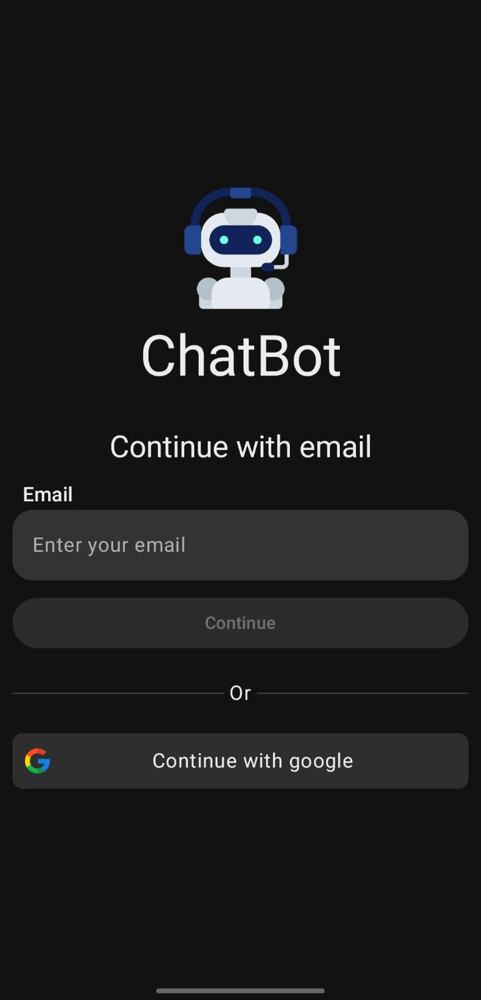
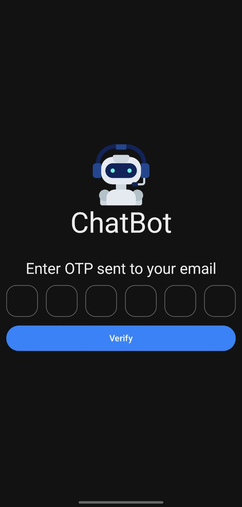
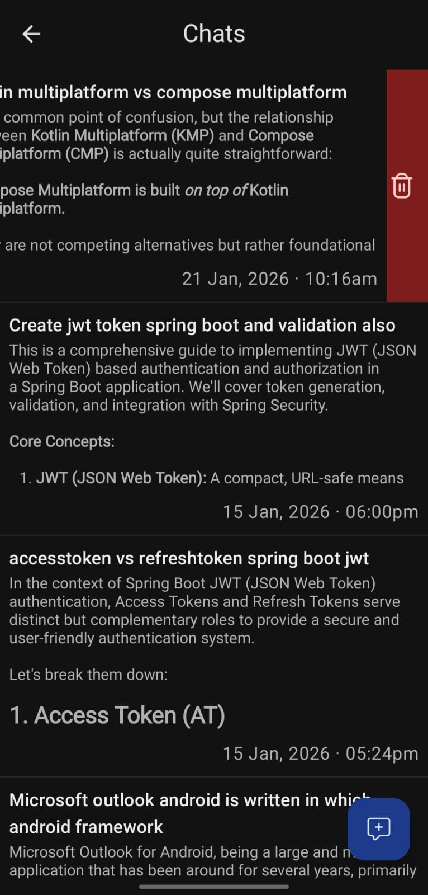
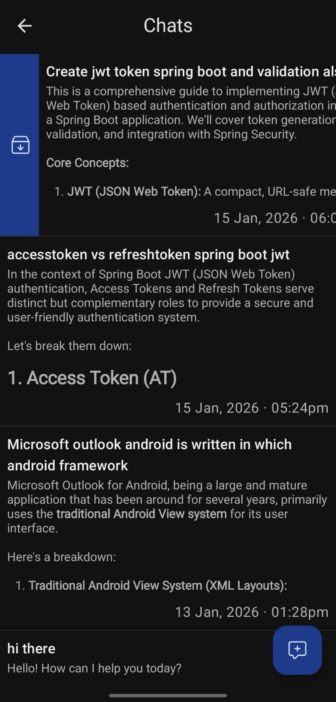
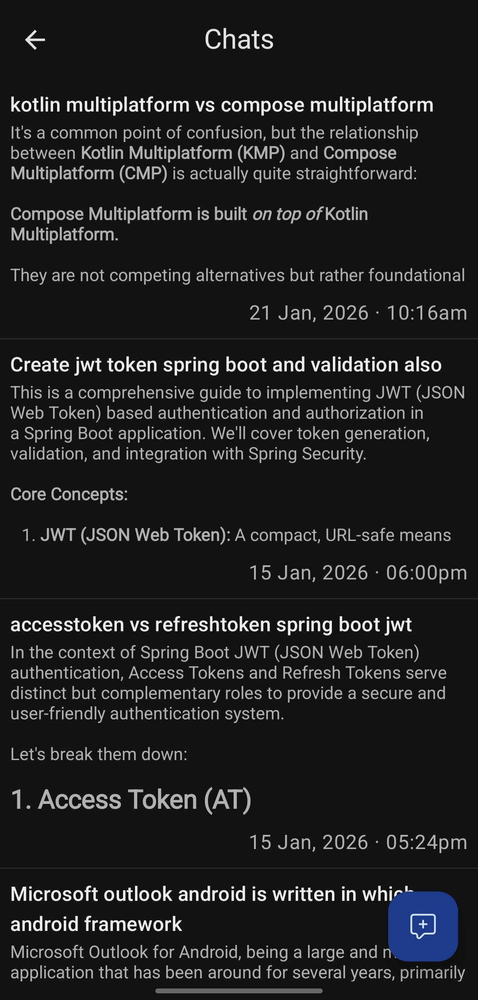

# ChatBot
## Features

- Authentication
    - Google Auth
    - Email Otp verification

- Archive chats
- Save chats

## Technology used
- Google FirebaseAi
- Jetpack Compose
- Supabase for authentication and storage

## Theme
- Dark & Light mode available

# Auth - Email | Google

# Verify OTP

# Chat

# Swipe to delete chat

# Swipe to archive chat

# Chats

